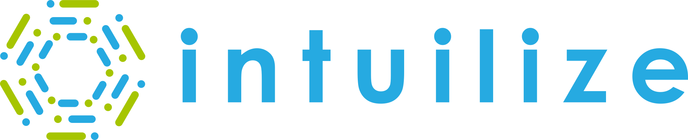

 
 
 

# **Intuilize-CS-Project**
Intuilize is a leading Machine Learning and change management company dedicated to enhancing profitability of wholesalers through the optimization of pricing and inventory.

## **Project Description**
To enhance Intuilize's customer and product segmentation by estimating the likelihood of customer or products transitioning between segments. This will allow Intuilize to better understand the customer and product segments and how they change over time.

## **Objective:**
1. Develop Python-based software leveraging ML tools for identification with confidence notations.
2. Apply ML classification (segmenation) on the dataset available through price and customer segmentation.
3. Create classification models and select the most accurate one.
4. Evaluate model performance using popular information criteria metrics.
5. Estimate the probability of customers and prodcuts either moving up or down within their segment.

**Client:** Mahesh Iyer and Nelson Valderramma (Intuilize).

## **Deliverables and Priorities:**

| Deliverables | Type of Work | Resources | Tech Skills | Priority |
| --- | --- | --- | --- | --- |
| Requirements Analysis Document | Requirement Analysis | Client lead & SME | System and requirement analysis and documentation | High |
| Data Model Design and Plan Document | Data model planning  | Client Lead & SME  | Data model design and documentation | High |
| Data Gathering and Aggregation | Creating the dataset to be used for training and testing | Client lead, SME and Project Coach  | Data Preparation | High |
| Machine Learning Predictors | Machine Learning modeling and documentation | Project coach, freely available ML tools | Scikit Learn, Python, Data Science and Machine Learning etc | High |
| Summary of Findings presentation and document | Summary results of exploration and recommendations | Client Lead, SMEs, project coach | Written and oral presentation | Medium |
| Handover document  | Project next-phase planning and documentation | Descriptions and plans on what to tackle in the next phase of the project | Next Phase of the Project | High |
